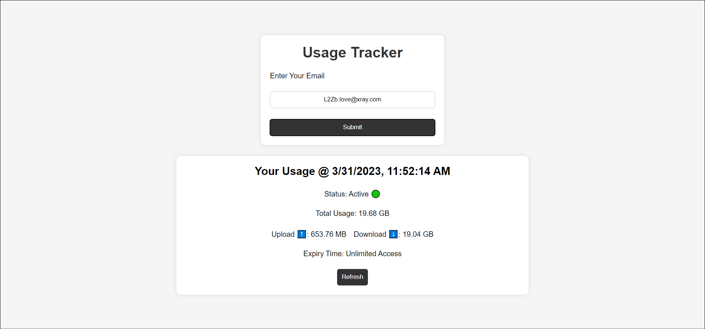

# X-UI Usage Monitor
## Table of Contents

- [About](#about)
- [Getting Started](#getting_started)
- [Usage](#usage)
- [Screenshots](#screenshots)
- [TODO](#todo)

## About <a name = "about"></a>

X-UI usage monitor for its users, If you have limited bandwith in your vps you can use this to monitor all user data.

This program can download database from x-ui instances using sftp and display it in website. 

## Getting Started <a name = "getting_started"></a>

These instructions will get you a copy of the project up and running on your local machine for development and testing purposes. 


### Installing
clone this repository and run

```
yarn install
```
or
```
npm install
```

It will install all dependencies

after that you need to add your VPS credentials to hosts.js file in config folder

finally run the program using

```
yarn start
```
or
```
npm start
```

## Usage <a name = "usage"></a>

It will automatically download database from your x-ui installed VPS (db location can be changed from .env file)


## Screenshots <a name = "screenshots"></a>



## TODO <a name = "todo"></a>

- [ ] Add admin panel
- [ ] Create Dockerfile
- [ ] Add telegram notifications for users