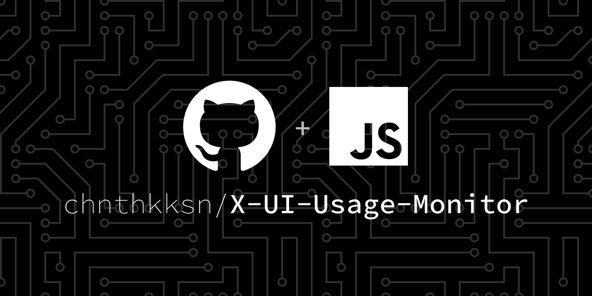

# X-UI Usage Monitor



## Table of Contents

- [About](#about)
- [Getting Started](#getting_started)
- [Usage](#usage)
- [Screenshots](#screenshots)
- [TODO](#todo)
- [Authors](#authors)
- [License](#license)
- [Acknowledgments](#acknowledgement)
- [Contributing](#contributing)

## About <a name = "about"></a>

X-UI usage monitor for its users, If you have limited bandwith in your vps you can use this to monitor all user data.

This program can download database from x-ui instances using sftp and display it in website. 

## Getting Started <a name = "getting_started"></a>

Clone this project to your local machine using

```
git clone https://github.com/chnthkksn/X-UI-Usage-Monitor.git
```

### Installing

Run the following command to install all dependencies

```
yarn install
```
or
```
npm install
```

After that you need to add your VPS credentials to hosts.js file in config folder refer host.js file and edit it. ( Make sure the user you added has acess to /etc/x-ui ) <br>

.env file is also required to run the program, you can add your own credentials to it , refer .env file and edit it.


Required Fields in .env file are

- `PANEL_USERNAME`: Use this as the username in login to admin area `Str`
- `PANEL_PASSWORD`: Use this as the password in login to admin area `Str`
- `PANEL_PORT`: Port on which admin panel will run `Int`
- `JWT_SECRET`: Secret key for JWT `Str`

### Running

After installing all dependencies and adding credentials to .env file you can run the program using

```
yarn start
```
or
```
npm start
```

## Usage <a name = "usage"></a>

It will automatically download database from your x-ui installed VPS and display it in website.


## Sample <a name = "screenshots"></a>


## TODO <a name = "todo"></a>

- [x] Add admin panel
- [ ] Create Dockerfile
- [ ] Add telegram notifications for users

## Authors

- [@lahirubro123](https://github.com/lahirubro123) - Idea & concept
- [@chnthkksn](https://github.com/chnthkksn) - Code and design

## License

This project is licensed under the MIT License - see the [LICENSE](LICENSE) file for details

## Acknowledgments

- [x-ui](https://github.com/vaxilu/x-ui) - X-UI is a web panel for Xray, V2ray, Trojan, SSR and NaiveProxy.

## Contributing

Contributions are what make the open source community such an amazing place to be learn, inspire, and create. Any contributions you make are **greatly appreciated**.
